# Logistics ML Platform — Untangling Session Flowchart

```mermaid
flowchart TD
    A[Start: review k8s/ manifests] --> B[Discover mlflow:local and flink:local<br/>are phantom images - nothing builds them]
    B --> C[Discover charts/logistics-ml-platform<br/>already exists, bakes in same stale images]
    C --> D[Check CI/CD workflows]
    D --> E[mlflow-build job already exists in ci.yml<br/>-> just fix values.yaml image ref]
    D --> F[flink / flink-submit have Dockerfiles<br/>but NO CI job at all]
    D --> G[cd.yml is dead: builds from<br/>nonexistent service/Dockerfile]

    E --> H[Fix 1: values.yaml mlflow.image -> GHCR tag]
    H --> I[helm lint + helm template: PASS]

    I --> J[Test: helm install on kind cluster]
    J --> K[etl + mlflow: ImagePullBackOff<br/>401 Unauthorized from ghcr.io]
    K --> L[Root cause: GHCR packages are PRIVATE<br/>no imagePullSecrets anywhere in chart]

    L --> M{Public or Private?}
    M -->|Keep private| N[Build imagePullSecrets properly]

    N --> N1[Add global.ghcr username/token to values.yaml<br/>gitignored-style corner cut, same as postgres pw]
    N1 --> N2[PAT mishap: fake token pasted -> no real leak]
    N2 --> N3[Create templates/ghcr-pull-secret.yaml<br/>dockerconfigjson Secret]
    N3 --> N4[Bug: double base64-encoded the whole JSON<br/>fix: only inner auth field needs b64enc]
    N4 --> N5[Wire imagePullSecrets into etl job]
    N5 --> N6[TEST: etl job -> Completed OK<br/>auth chain proven end-to-end]

    N6 --> O[Check why GHCR images were stale/missing]
    O --> O1[gh run list: recent kube-branch CI runs all FAILING]
    O1 --> O2[Branch gate: build jobs only ran on refs/heads/main<br/>-> relax to run on all branches]
    O2 --> O3[cd.yml fails in parallel: dead workflow<br/>-> deleted]
    O3 --> O4[branches: **_ invalid YAML syntax<br/>-> fixed trigger block]
    O4 --> O5[validate job: kubectl dry-run needs live cluster<br/>-> replaced with offline kubeconform]
    O5 --> O6[validate job: entrypoint-check regex only<br/>captured first path segment, broke on<br/>nested packages like streaming.producer<br/>-> fixed regex + file-or-package check]
    O6 --> O7[CI green: validate -> build-python-base<br/>-> build-python + mlflow-build]

    O7 --> P[mlflow-build fails: FROM logistics-python-base:latest<br/>unqualified -> tries Docker Hub, not GHCR]
    P --> P1[Fix docker/mlflow/Dockerfile: ARG BASE_IMAGE param<br/>+ wire build-args in ci.yml<br/>+ needs: build-python-base for ordering]
    P1 --> P2[TEST: full CI run -> ALL GREEN<br/>real images pushed to GHCR]

    P2 --> Q[Roll out imagePullSecrets to mlflow deployment]
    Q --> Q1[TEST: mlflow -> Running 1/1]
    Q1 --> Q2[Re-run training job -> now succeeds<br/>previous failures were just mlflow being down]

    Q2 --> R[Item: build missing api templates]
    R --> R1[Chart had NO api deployment/service at all<br/>old k8s/service-*.yaml never ported]
    R1 --> R2[Write templates/api/deployment.yaml<br/>+ templates/api/service.yaml]
    R2 --> R3[TEST: helm upgrade -> api Running<br/>curl through Service -> HTTP 200]

    R3 --> S[Item: flink / flink-submit still have<br/>no CI build path - running on cached<br/>local images only]
    S --> S1[Add build-flink job: docker/flink/Dockerfile]
    S1 --> S2[Add build-flink-submit job:<br/>docker/flink/Dockerfile.submitter]
    S2 --> T[Next: push + watch CI,<br/>then update values.yaml flink image refs]

    style A fill:#eee,stroke:#333
    style T fill:#eee,stroke:#333
    style K fill:#fdd,stroke:#900
    style O1 fill:#fdd,stroke:#900
    style P fill:#fdd,stroke:#900
    style N6 fill:#dfd,stroke:#090
    style O7 fill:#dfd,stroke:#090
    style P2 fill:#dfd,stroke:#090
    style Q1 fill:#dfd,stroke:#090
    style R3 fill:#dfd,stroke:#090
```

## Summary of confirmed fixes (tested against live kind cluster)

| Component | Problem | Fix | Status |
|---|---|---|---|
| mlflow image | pointed at phantom `mlflow:local` | corrected to GHCR tag | ✅ tested |
| GHCR auth | private packages, no pull secret existed | `dockerconfigjson` Secret + `imagePullSecrets` wired into etl, mlflow, api | ✅ tested |
| CI branch gate | build jobs only ran on `main` | relaxed to all branches (temporary) | ✅ tested |
| `cd.yml` | built from nonexistent `service/Dockerfile` | deleted | ✅ |
| CI trigger syntax | `branches: [**]` invalid YAML | fixed | ✅ tested |
| k8s dry-run validation | needed live cluster, none available in CI | replaced with offline `kubeconform` | ✅ tested |
| entrypoint check script | regex broke on nested packages (`streaming.producer`) | fixed regex + file-or-package check | ✅ tested |
| mlflow Dockerfile | unparameterized `FROM logistics-python-base:latest` → tried Docker Hub | added `ARG BASE_IMAGE`, wired `build-args` | ✅ tested |
| api deployment/service | never existed in the Helm chart | wrote both templates | ✅ tested |
| flink / flink-submit CI | no build job existed anywhere | added `build-flink`, `build-flink-submit` jobs | ⏳ pending confirmation |

## Still open

- Point `values.yaml` `flink.image` / `flink.submitJobImage` at new GHCR tags once CI confirms green
- Immutable SHA tagging (everything still on mutable `:latest`)
- Delete/reconcile now-superseded `k8s/` legacy folder
- `postgres-secret.yaml` unused — `DATABASE_URL` still plaintext env var
- Resource requests/limits missing on api deployment
- Re-tighten CI branch gate back to `main`-only (or add branch protection) once stable
